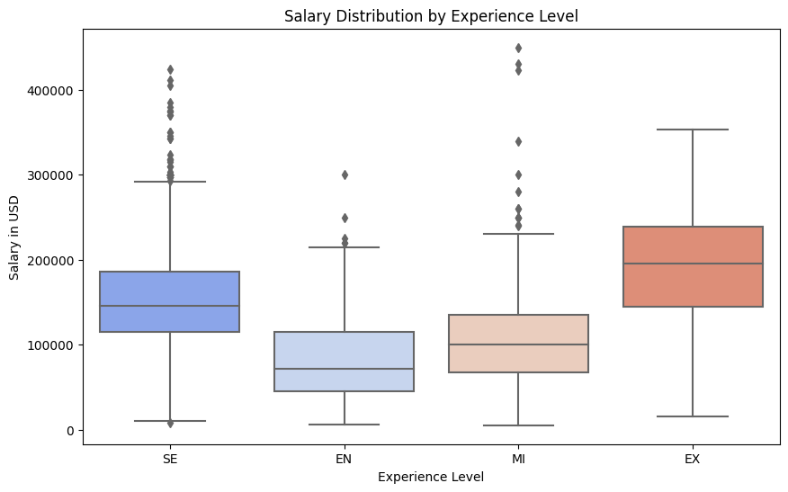
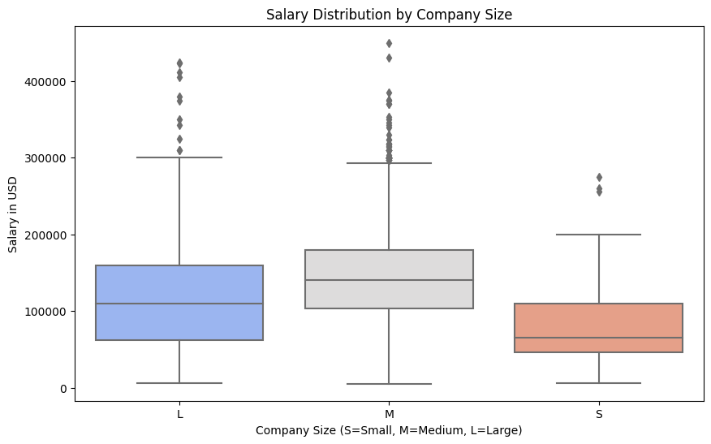
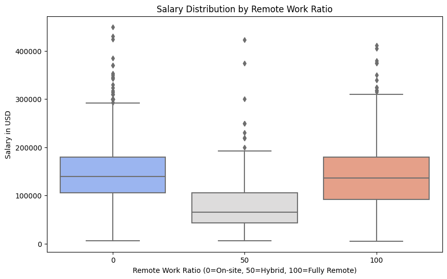
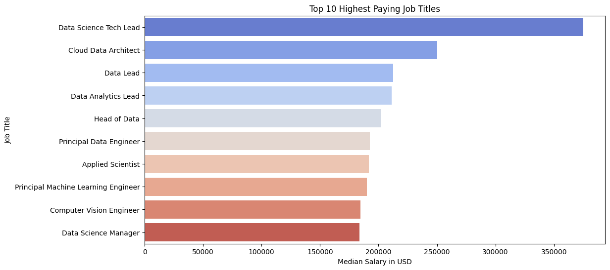
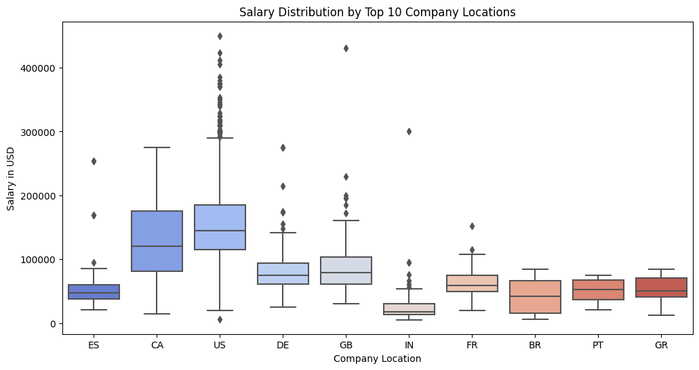

# Salary Prediction Analysis

## Project Overview

This project analyzes salary trends in the data science industry using historical salary data. It explores key factors influencing compensation, such as experience level, job role, company size, and remote work trends. The goal is to provide insights that help stakeholders understand salary distribution and make informed hiring or career decisions.

## Exploratory Data Analysis (EDA)

Key insights from our data exploration:

1. **Salary Distribution by Experience Level**:

   - Entry-level roles generally have lower salaries, while executive-level positions command significantly higher pay.
   - The spread of salaries within each experience level helps identify pay disparities and potential growth opportunities in the field.
   - Organizations and job seekers can use this information to benchmark fair compensation based on career stages.
     

2. **Salary Trends by Company Size**:

   - Large companies (L) tend to offer higher median salaries compared to small (S) and medium-sized (M) firms.
   - The variance in salary distribution suggests that smaller firms may provide competitive salaries for niche or highly specialized roles.
   - Understanding these salary structures helps job seekers determine if a smaller firm offers higher value in career progression despite lower salary averages.
     

3. **Impact of Remote Work on Salaries**:

   - Fully remote positions (100% remote) show competitive pay, sometimes surpassing onsite roles.
   - Hybrid roles (50% remote) have a salary spread that is influenced by company policies, cost-of-living adjustments, and industry demand.
   - This insight is crucial for professionals considering remote work opportunities, as some companies might offset lower office costs with competitive remote salaries.
     

4. **Top Paying Job Titles**:

   - The highest median salaries are observed in leadership roles like Principal Data Scientist, ML Engineer, and Applied Scientist.
   - This visual helps professionals understand which technical expertise and experience levels command the highest pay.
   - It can guide career planning for those looking to transition into higher-paying roles within the data industry.
     

5. **Salary Differences by Company Location**:

   - Companies in countries like the U.S. and Canada offer significantly higher salaries compared to other regions.
   - Variability in salary distribution across locations suggests that market demand, cost of living, and economic conditions heavily influence pay.
   - Job seekers can use this information to weigh the benefits of relocating or negotiating salaries based on regional standards.

     

## Data Cleaning & Feature Engineering

- Removed non-relevant columns like `salary_currency`, `employee_residence`, and `work_year`.
- Filtered data to focus on full-time employment (`employment_type=FT`).
- Standardized salary data in USD for consistency.

## Feature Importance & Correlation Analysis

### Feature Importance

Feature importance is a measure of the relative importance or relevance of each feature to the model's prediction. The number in the chart below quantifies how much each feature contributes to the model's overall performance in making accurate predictions. We used this information in decision-making to identify influential features and gain further insights into the model's behavior.

### Correlation to the Target Variable

We used this metric to assess the relationship between each individual feature and the target variable (`salary_in_usd`). A positive correlation means that as the feature increases, the target variable tends to increase, while negative correlation means that as the feature increases, the target variable tends to decrease. Correlation to the target variable was also analyzed to assess the feature's behavior.

## Modeling Approach

- Tested various regression models including:
  - Random Forest Regressor
  - Gradient Boosting
  - Support Vector Regression (SVR)
- Evaluated model performance using metrics like RMSE, MAE, and R² score.

## Model Evaluation

- **Supervised Learning Models**: Evaluated different approaches for predictive accuracy.
- **Neural Network Models**: Considered but not fully implemented in this phase.

## Results & Insights

- The best-performing model was **Random Forest**, achieving the highest accuracy in salary prediction.
- Feature importance analysis indicated that **job title and experience level** are the strongest predictors of salary.

## Business Insights for Stakeholders

1. **Competitive Salary Benchmarking**:

   - Companies can use this data to adjust their salary structures to remain competitive in hiring top talent.
   - Job seekers can leverage this information to negotiate better salaries based on industry trends.
   - Understanding pay gaps between experience levels helps HR teams optimize compensation strategies for career progression.

2. **Workforce Planning and Hiring Strategies**

   - Higher salaries in leadership roles suggest companies must focus on internal growth and retention of skilled employees to avoid costly hiring.
   - Salaries vary across company sizes, indicating smaller firms may need to offer other benefits like equity, bonuses, or flexible work arrangements to attract talent.
   - Remote work salary trends highlight opportunities for businesses to expand their talent pool by offering remote positions with competitive pay.

3. **Global Market Positioning**

   - Companies expanding into high-paying markets (e.g., U.S. and Canada) should account for increased compensation costs while leveraging regional salary expectations.
   - Understanding salary disparities by location enables companies to decide where to establish remote work hubs or expand operations cost-effectively.

4. **Data-Driven Decision Making in Talent Acquisition**

   - HR departments can use salary insights to reduce turnover rates by offering market-aligned compensation.
   - Hiring managers can focus on job titles that yield the highest ROI in terms of salary vs. business impact.
   - The correlation between experience level and pay ensures that organizations recruit candidates who align with their salary budgets and long-term growth strategies.

5. **Strategic Budget Allocation**

   - Companies can forecast salary growth trends and allocate budgets efficiently based on market dynamics.
   - Investment in higher-paid roles such as ML Engineers or Data Scientists may drive business innovation and competitive advantage.

## Conclusion & Next Steps

- Salary trends suggest that seniority, remote work, and company size play significant roles in compensation.
- Future work could involve:
- Expanding the dataset with real-time salary updates.
- Developing an interactive dashboard for users to explore salary predictions.

## Contributors

- **Philip Timothe** (PhilippeTimothe@gmail.com)
- **Bryan Lu** (btl245@stern.nyu.edu)
- **Vadim Yermak** (vadik.ermak@gmail.com)
- **John Nguyen** (nguyenjohn1337@gmail.com)
- **Cherryl Adzang** (cherryl.adzang@gmail.com)

## How to Run the Analysis

1. Install dependencies:
   ```bash
   pip install pandas numpy matplotlib seaborn scikit-learn
   ```
2. Run the Jupyter Notebook (`SalaryPrediction.ipynb`).
3. Explore visualizations and model results.

---

**Author:** Philip Timothe
